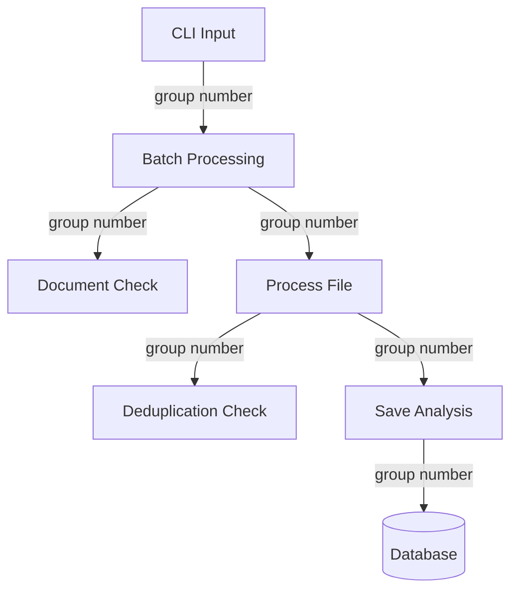

# Group Processing Implementation

## Overview
The group processing feature is implemented across several components of the system. This document details the technical implementation and how the group number flows through the processing pipeline.

## Components

### 1. Command Line Interface
The group flag is implemented in `src/index.mjs`:
```javascript
.option('-g, --group <number>', 'group number for the documents', parseInt)
```

### 2. Database Layer
The group number is stored in the `document_sources` table and is used in several key operations:

#### Document Existence Check
```javascript
// In dbService.mjs
export async function checkDocumentExists(filename, reprocessIncomplete = false, groupNumber = null) {
    let query = supabase
        .from('document_sources')
        .select('id, filename, status');

    if (groupNumber !== null) {
        query = query.eq('group_number', groupNumber);
    }
    // ...
}
```

#### Deduplication Check
```javascript
// In deduplication.mjs
async function checkDocumentHashExists(contentHash, groupNumber = null) {
    if (groupNumber !== null) {
        const { data } = await supabase
            .from('documents')
            .select('id, document_sources!inner(group_number)')
            .eq('content_hash', contentHash)
            .eq('document_sources.group_number', groupNumber)
            .neq('status', 'failed');
        // ...
    }
    // ...
}
```

### 3. Document Processing Pipeline
The group number flows through the processing pipeline:

1. Initial document check (`checkDocumentExists`)
2. Document processing (`processFile`)
3. Deduplication check (`checkDuplicateDocument`)
4. Document saving (`saveAnalysis`)

## Data Flow



## Implementation Details

### 1. Group Number Propagation
The group number is passed through the entire processing pipeline:
```javascript
// In batch processing
const result = await processFile(
    text, 
    options.type, 
    filename,
    parseInt(options.maxChunkLength),
    options.overview,
    options.skipMetadata,
    options.continuation,
    options.group  // Group number passed here
);
```

### 2. Database Operations
When saving documents:
```javascript
await saveAnalysis(text, type, {
    filepath: filename,
    warnings: result.warnings || [],
    groupNumber: options.group  // Group number included in metadata
});
```

### 3. Deduplication Logic
The deduplication check considers group numbers:
```javascript
export async function checkDuplicateDocument(content, groupNumber = null) {
    const contentHash = calculateContentHash(content);
    const { exists, documentId } = await checkDocumentHashExists(contentHash, groupNumber);
    return { isDuplicate: exists, documentId };
}
```

## Error Handling

- If group number is invalid: Treated as no group specified
- If group number is missing: Document is checked against all groups
- Database errors: Logged and processing continues without group filtering 